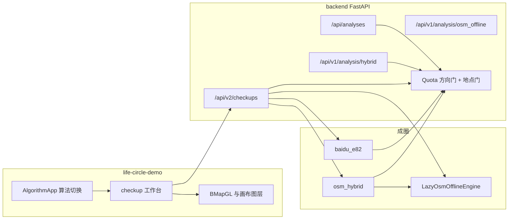
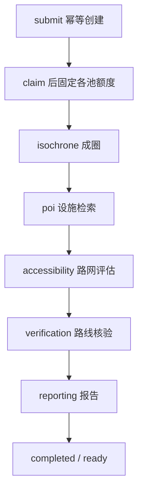

# 项目架构说明

面向要改代码、接接口或加算法的开发者。本文只讲模块怎么拼、数据怎么流、哪些边界不能破。算法细节、验收记录和操作步骤分别见文末索引，不在这里重复。

当前产品面是「15 分钟生活圈体检」：给定一个 BD09LL 中心，用选定算法算出 900 秒步行圈，再在圈上检索设施、用路网估计服务覆盖，并用有限次数的百度路线做核验，最后出报告和热力。页面只走体检 v2；旧成圈接口仍在后端保留，契约互不兼容。

## 1. 仓库怎么分

```text
baidu-map/
  life-circle-algorithm/   可安装的 Python 包 life_circle：共享模型、坐标、百度步行适配、历史自适应网格
  backend/                 FastAPI 应用。成圈引擎、体检编排、配额、POI、评估都在这里
  life-circle-demo/        React 工作台。生产入口是体检 v2；demo 模式是另一套示意数据
  data/osm/                上海 OSM 图缓存、覆盖边界、障碍层、风险层（大文件不入库）
  data/water-reviews/      按 OSM 版本绑定的水系复核，只在自己的范围内生效
  docs/                    项目级说明（本文）
```

三者的依赖方向是固定的：

- `life_circle` 不认识 HTTP、体检或前端。它提供 `IsochroneRequest`、`CancelToken`、`ProgressSnapshot`、BD09LL 坐标工具和 `BaiduProvider`。
- `backend` 以可编辑安装依赖这个包（`pip install -e ../life-circle-algorithm`），再在 `app/` 里实现产品。
- 前端不装算法包，只通过 HTTP 契约说话。浏览器地图 AK 与服务端步行 AK 分开，服务端密钥不得放进任何 `VITE_*`。

生产成圈**不**走 `life_circle.engine.compute_isochrone` 那条历史自适应网格。那条路径留在算法包里做离线实验和 CLI。线上百度边界搜索走 `backend/tools/endpoint_multicross_boundary.py`，由 `app/algorithms/baidu_e82.py` 适配成任务结果。

## 2. 运行时总览

一个进程、一个 worker。任务管理器、限流门和内存中的旧任务都假设单进程；多 worker 会把配额和并发限制拆成多份。



`app/main.py` 的 `create_app` 是唯一装配点：

1. `load_settings()` 读 `backend/.env`，进程环境变量优先。
2. 建一个 `Quota`。方向门（步行路线）和地点门（地点检索）分开，全应用共用这一对，避免两套限流器在同一把钥匙上相加。
3. 建 `AnalysisManager`（旧 `/api/analyses`）和 `HybridManager`（旧 Hybrid 任务）。它们与体检共用方向门，但任务状态、请求体和结果类型各自独立。
4. 建 `LazyOsmOfflineEngine`。启动和 `/health` 不加载全市图；第一次 Hybrid 或评估才惰性加载。
5. `build_checkups` 打开体检库、注册两个引擎、把 `Quota` 注进去。
6. 开始对外服务时才 `interrupt_unfinished()`：把上次没跑完的体检标成 `interrupted_by_restart`，不重放已付费请求。导入 app 对象（例如导出 OpenAPI）不算重启，不会去清点。

## 3. 三条入口，三套契约

请求点名算法。服务端不会在引擎失败时静默换另一套，也不会接受对方的请求体。

| 入口 | 谁在用 | 请求形状 | 引擎 | 任务存在哪 |
| --- | --- | --- | --- | --- |
| `POST /api/v2/checkups` | 当前页面 | `center` / `engine` / `schemaVersion=checkup-v1` | `baidu_e82` 或 `osm_hybrid` | `backend/.checkups`，SQLite + 不可变修订 JSON |
| `POST /api/analyses` | 旧接口，页面已不走 | `center` / `coordinateSystem` / `budget` | 薄适配进同一套 E8.2 核心，成圈后自己做设施阶段 | 进程内存，终态保留有限时间和条数 |
| `POST /api/v1/analysis/hybrid` | 旧接口 | `origin` / `coordinate_system` / `config` | Hybrid v1.5 成圈，设施未接入 | 内存任务 + `.hybrid-ledgers` 账本；重启不续跑 |

另外两条不是产品入口：

- `POST /api/v1/analysis/osm_offline`：离线路网基线，同步返回，不调用百度。
- `GET /api/v1/analysis/mock/{scenario}` 与 `POST /api/v1/analysis/synthetic`：契约验收夹具，不是任务 API 的备用数据源。

错误信封也按路径分开。`/api/v2/` 是 `{code, message}`；Hybrid 同样是带 `code` 的对象；`/api/analyses` 沿用自己的任务响应。校验失败不回显原始输入、URL 或密钥。

能力发现只在 v2：`GET /api/v2/capabilities` 返回引擎档位、距离规则、OSM 版本、水系复核目录和本应用配额余额。前端预算档从这里来，不写死。余额文案是「本应用预算余额」，不含浏览器 SDK、其他应用和旧接口流量，改措辞就会被当成账号总余额。

## 4. 体检 v2：主路径

编排在 `app/checkups/manager.py`。同一时刻只跑一个任务，第二个排队而不是 409。任务级截止约 1800 秒；800 档成圈自己还可以再用到 1200 秒，编排会在截止上再加 600 秒。

一次运行按阶段发布**不可变修订**。每一修订是一份完整文档，读者不用把两个文件拼起来。后一修订的结果哈希覆盖它重复的全部组别。已付费的阶段结果在取消时仍然冻结，不丢弃。



| 阶段 | 代码 | 做什么 | 不做什么 |
| --- | --- | --- | --- |
| 成圈 | `app/engines/` | 只调用该引擎的 compute-only 接缝，得到 `IsochroneSnapshot` | 不走旧任务管理器。旧管理器成圈后会再检索一次设施 |
| 设施 | `checkups/facilities.py` + `app/poi/` | 在冻结圈面上检索、分类、去重。圈外邻近点保留为 `nearbyFacilities`，参与覆盖、不计入圈内数量 | 不把设施结果回流去改边界。检索失败不是零设施 |
| 评估 | `app/accessibility/` + `app/scoring.py` | 用全市步行图做 1000 米服务场，50 米格、证据不足细化到 25 米，再按冻结评估域算面积 | 评估与「哪套算法画的圈」无关，两套引擎共用同一张路网。面积不闭合则该类别降为无法确定，不把整单打成失败 |
| 核验 | `checkups/verification_stage.py` | 120 次路线预算：中心可达性最多 40 次，覆盖抽检最多 80 次。端点偏移都不超过 50 米时按「路线距离 + 两端偏移」判定；严格层只是附加标志 | 直线距离只用于排队。一条路线只给它所在的 25 米格定论。走不通最多把格子降为未知，不会判成缺口 |
| 报告 | `checkups/reporting_stage.py` + `scoring.py` | 复述已冻结的评估与核验，不重算 | 业务状态最高是 `partial`。目录未经独立核验，成功跑完也不标 `complete` |

图层与修订一一对应，由 `GET /api/v2/checkups/{id}/layers/{layerId}` 提供：`isochrone`、`facilities`、`accessibility`、`service_gaps`、`heatmap`、`verification`、`report`。某一组还没发布是带名字的 409，不是空几何。空集合画在地图上会被读成「这里什么都没有」。修订不可变，所以图层带 `ETag`；`If-None-Match` 命中返回 304。

点击设施详情走 `POST /api/v2/checkups/{id}/routes/{facilityId}`，只接受本任务自己检索到的设施 ID，每次尝试先记账，单任务详情池 20 次。这个池在进程内；保护账户的是持久配额账本，重启后详情计数会重新计，已入账的消耗不会抹掉。

取消用 `life_circle.models.CancelToken`，在配额入口、核验、路线和评估里逐次生效。`EngineCancelled` 是业务取消，任务结束、worker 继续；`asyncio.CancelledError` 是进程在停，必须继续抛出。

## 5. 两套成圈引擎

注册表在 `app/engines/__init__.py` 的 `build_registry`。`EngineRegistry.validate` 拒绝未知引擎 ID 和不在该引擎档位里的预算，返回 404 或 422，不改道。

引擎只接收 `IsochroneAsk(origin, budget)`。半径、步长、细化策略由服务端写死，请求不能覆盖。输出是 `IsochroneSnapshot`：几何、未知区、计算范围、质量、停止原因，以及只用于描边的 `displayGeometry`。`displayGeometry` 不参与计数、评估域或热力裁剪。`isochroneHash` 只标识边界；设施和空间分析另有结果哈希，后一阶段不能悄悄继承成圈摘要。

### 5.1 百度边界搜索 `baidu_e82`

- 标识：`algorithm=local-multicross-e82`。2026-09-29 起生产默认细化是闭环版，`config_version=local-multicross-e82.1`。旧流程保留为 `refinement='legacy'`，不作为页面选项。
- 档位：200 / 400 / 800，默认 400。计算域 ±1600 米，不扩展。400 档及以下截止 600 秒，800 档 1200 秒。
- 调用链：`BaiduE82Engine.compute` → `compute_e82` → `tools/endpoint_multicross_boundary.py`。16 方向初始化后，加方向、补丁扫描、混合边二分和探索进入同一调度；圈面、补丁和求解未决区来自同一证据版本。
- 证据来自百度实际返回的路线端点，不来自合成端点。`ANALYSIS_PROVIDER=synthetic` 或测试注入的 `provider_factory` 使用 `EndpointAnalyticProvider`，即使配置了 AK 也不访问真实百度。
- 不需要 OSM 图才能成圈。内部未独立核验，质量不会高于 `partial`；没有建起边界时是 `insufficient`，整个计算域标为未决，不推断为不可达。
- 未决区可以和圈面重叠，不是误差上界。已知负证据被覆盖时以 `min(50, 0.49·d)` 圆盘挖除。

E8.3（POI 引导联合构圈）在 `backend/tools/endpoint_e83_*`，只做离线实验，没有 HTTP 入口。

### 5.2 OSM＋百度 `osm_hybrid`

- 核心在 `app/algorithms/hybrid_isochrone/`，版本字符串来自 `extent.ALGORITHM_VERSION`（v1.5）。
- 档位：200 / 400，默认 400。计算域默认是投影平面上 ±1200 米的正方形，不是 E8.2 的 ±1600 米圆域。生成预算上限 400，默认约 3 QPS，仍走共享方向门。
- 调用链：惰性加载全市图 → `OsmGuidance` 用路网给出采样引导 → `load_obstacles` 读水体障碍并套用水系复核 → 百度步行核验采样点 → 成面并扣除水体。
- 缺图、版本不符、覆盖不够或风险层无效时，就绪项标 `degraded` 并降低质量，不声称完整 Hybrid。
- 真实流量必须有任务工件目录里的发送前账本（`hybrid-ledger.json`）。账本是引擎审计，体检修订另外发布。重启不根据账本续跑。
- 地图只画扣除水体前的外壳（`displayGeometry` / `coverage.shell`）：不填色、不画水体内孔、不把离散分量连成一块。计算几何、面积和诊断仍用原字段。

### 5.3 OSM 离线图层的第三种角色

`app/algorithms/osm_offline/` 不是页面上的第三种算法。它做三件事：给 Hybrid 当引导图、给体检评估当「1000 米步行」的距离场、以及独立的 `/osm_offline` 基线接口。图是 MultiDiGraph，步行方向按 OSM 的步行限制，不把汽车单行套到行人身上。buffer 面只用于显示，不是离路步行许可。OSM 不是真值。

## 6. 共享基础设施

### 配额

`app/quota.py`。方向服务和地点服务各有门、各有日预算，日界是 Asia/Shanghai，不读主机时区。尝试在发出前预约日预算和任务池；排队过期不计数，已发出的失败和重试都计数。账本在 `backend/.quota/quota.sqlite3`。

两套成圈引擎和旧接口直接在方向门上排队，用自己的档位停；它们的尝试不从体检的任务池里扣。体检的设施检索、核验和详情才通过池预约，因此才会出现在日账本里。`ANALYSIS_QPS` 只能把当前档位再压低，不能抬过档位上限。`baidu_quota_fallback_at` 之后切到更保守的档；这是工程切换时刻，不是控制台配额到期的声明。

### 坐标

线上几何一律是 BD09LL，经度在前，**不是** WGS84 GeoJSON。字段里显式带 `coordinateSystem`。米制计算用 `EPSG:32651`（上海）。`life_circle.coordinates.LocalProjection` 做局部米制；Hybrid 与障碍层用 `app/geo/projection.py` 的 `MetricProjection`。百度坐标非线性，米制边转回 BD09LL 时必要时加密，再在既有面积容差内修数值异常，不放宽容差掩盖拓扑变化。

### 设施目录与距离规则

类别只有一份字典：`app/categories.json`，经 `app/catalog.py` 读出。检索词、名称提示和供应商标签提示不是同一份列表，不能混用。`primary_school` 是 POI 运行时对 `school` 的历史拼法，不是第二个类别。

距离规则在 `app/service_rules.py`，各阶段从这里推导，不另写无关常数：步行 1000 米含边界，容差带 100 米，入口吸附 50 米，检索外包是这些量再加上坐标换算余量。900 秒是成圈阈值；1000 米是设施服务标准。二者不是同一个数，也不能互相换算。

### 缓存

地点分页、路线和空间结果的跨任务复用由 `cache_freshness_seconds` 控制。未配置时缓存只在写入它的那个任务内复用，不假定部署有数据使用协议，也不把条目当成永久新鲜。成圈采样缓存按 Provider 身份、选项、实际起点和坐标系分命名空间，反向和不同 UID 不共用。

## 7. 前端

生产入口是 `src/main.tsx`：`VITE_ANALYSIS_MODE=demo` 才进旧示意工作台（`Store` + `App`）；其他值进 `AlgorithmApp`。地址是 hash，不是 History API：`#/checkup/e82`、`#/checkup/hybrid`。旧 `#/legacy/*` 规范到对应算法的体检页。没有 hash 时，`hybrid` 模式默认 OSM＋百度，其余默认 E8.2。

```text
src/checkup/          产品工作台。控制器、契约校验、会话、图层、报告
src/map/              BMapGL 加载与画布叠加：服务覆盖、密度、水系
src/analysis/         旧 /api/analyses 客户端，页面已不挂载，测试和定位控件仍引用
src/hybrid/           旧 Hybrid 客户端，同样不再是页面入口
src/taxonomy.ts 等    demo 管线：分类、去重、圈内判定。不用于 v2 结果
```

v2 的分工：

- `client.ts` 只讲 `/api/v2`。每个响应先过 `validate.ts`，不合法就抛错。逻辑看 `code`，界面显示 `message`，不要比较文案。
- `controller.ts` 负责提交、轮询、按修订取图层、取消和恢复。修订号对不上就不渲染。图层按 `图层:修订` 缓存，修订一变整组丢掉。
- `sessions.ts` 让控制器活在模块里，不活在组件里。卸载只是退订，不取消任务。本地只存任务句柄和界面偏好，不存结果；刷新后按句柄向后端要修订。
- `CheckupApp.tsx` 只排版。能选什么在 `capabilities.ts`，数字怎么读在 `report.ts`，画成什么在 `layers.ts`，三者都是纯函数。
- 热力在 `src/map/layers/`。服务覆盖与设施密度互斥，都裁在计算圈内（外环减孔，分量独立）。覆盖热力是路网模型估计，不是百度实测；实测看核验图层和报告。密度按疑似重复组去重，不代表覆盖率。

创建请求发出之前就把句柄交给 `onHandle`。创建响应丢失时用同一 `clientRequestId` 找回，不自动再提交，避免重复扣费。断网是「连接中断」，退避重试，不把任务判失败。只有用户点取消才取消。

## 8. 数据与进程边界

| 路径 | 内容 | 重启后 |
| --- | --- | --- |
| `backend/.checkups/` | 体检任务元数据（SQLite）和已发布修订（原子 JSON） | 未完成任务标中断；已发布修订保留；不续跑 |
| `backend/.quota/` | 本应用日消耗 | 保留。这不是百度账号真实余额 |
| `backend/.hybrid-ledgers/` | Hybrid 发送账本与诊断 | 不自动恢复成任务 |
| `data/osm/` | PBF、图缓存、`.poly`、障碍与风险 GeoJSON | 启动时不读；首次使用才加载，并核对覆盖边界哈希 |
| `data/water-reviews/` | 实地复核的水面修正 | 只采用与当前 `OSM_DATA_VERSION` 匹配的文件 |

图缓存缺失时相关就绪标志为假，质量降级，不在启动时失败。国定一水系复核绑定的 OSM 版本若与本机快照不符，会告警且不被采用，而不是套用到另一版图上。

部署约定：`--workers 1`。Hybrid 旧接口同时最多一个活动任务；`/api/analyses` 也是单槽，忙时 409 并说明占用情况，不泄露别人的任务 ID。体检 v2 改为排队。终态旧任务会过期；体检记录在库里，清掉数据目录后前端按 404 说明无法恢复。

## 9. 改哪里

| 要改的事 | 先看 |
| --- | --- |
| 加或换一种成圈算法 | 实现 `IsochroneEngine`，在 `build_registry` 注册。不要在管理器里 `if engine` 后调用另一套核心。档位写在该引擎的 `capabilities()` |
| 改 E8.2 采样或重建 | `backend/tools/endpoint_multicross_boundary.py`。适配层 `app/algorithms/baidu_e82.py` 只做契约转换，不改证据 |
| 改 Hybrid 采样、成面或水体 | `app/algorithms/hybrid_isochrone/`。设计约定在仓库根目录 `HYBRID_ISOCHRONE_DESIGN.md` |
| 改服务覆盖或灰区 | `app/accessibility/`。面积与分数在 `app/scoring.py`，它只认冻结面积，不认网格 |
| 改「1000 米」及其派生距离 | 只改 `app/service_rules.py` |
| 改设施类别或检索词 | 只改 `app/categories.json` |
| 改体检阶段顺序、修订或取消 | `app/checkups/manager.py`。新组别要同时进修订文档、图层路由和前端 `validate.ts` |
| 改配额或限流 | `app/quota.py` 与 `app/config.py`。不要再包一层会二次排队的门 |
| 改页面任务恢复或轮询 | `life-circle-demo/src/checkup/controller.ts` 与 `sessions.ts` |
| 改地图绘制 | `src/checkup/layers.ts` 与 `src/map/layers/`。不要用 `displayGeometry` 做裁剪或计数 |
| 离线算法实验 | `life-circle-algorithm` 与 `backend/tools/endpoint_e83_*`。不要接到 `create_app` |

## 10. 不要打破的不变量

- 两套引擎不是彼此的降级。请求、档位、失败都不能改道。
- 三套 HTTP 契约不能混用字段，也不能把 Hybrid 的 snake_case 结果交给 v2 或旧分析页的校验器。
- `displayGeometry` 只用于描边。
- 阶段未就绪用具名拒绝，不用空几何冒充「没有」。
- 检索失败、分页截断和零结果是三种状态。零结果不能推出服务缺失。
- 圈外邻近设施可以参与覆盖判断，不能计入圈内数量，也不能画成圈内发现。
- 设施分析不回写边界。E8.3 那种联合构圈不是生产路径。
- 业务状态不以 `complete` 表示目录已核全。`taskStatus=completed` 只表示流水线跑完。
- 未知和未收敛保持部分结果，不包装成精度达标。不生成或伪造 5/10 分钟圈。
- 全应用只有一对百度限流门。传输层包装向池要额度后，不得再在同一把门上排队。
- 测试与 `synthetic` 不得访问真实百度。自动测试在 `conftest.py` 拒绝外连，通过不代表社区精度验收。
- 日志和错误响应不记录 AK、完整 URL 或异常原文。

## 11. 本地运行与测试

启动、环境变量和联调步骤以 [本地启动与前后端联调](../backend/docs/本地启动与前后端联调.md) 为准。骨架是：后端 Python 3.11+，`uvicorn app.main:app --host 127.0.0.1 --port 8000 --workers 1`；前端 `npm run dev`，`VITE_API_BASE_URL=http://127.0.0.1:8000`。

不触网的检查：

```text
# backend/
python -m pytest -q
python -m tools.export_contract

# life-circle-algorithm/
python -m pytest -q

# life-circle-demo/
npm test
npm run build
```

`npm run test:analysis-ui` 用 HTTP 契约和地图替身，不需要 Python 或真实 AK。`npm run test:integration` 拉起专用端口上的 FastAPI 与合成 Provider，并禁止外部网络。真实百度调用是计费入口，必须单独记录引擎、配置和预算，不能用一套结果代替另一套。

## 12. 相关文档

- [当前算法状态](../CURRENT_STATE.md)：哪套是生产默认、页面还留着什么。
- [后端说明](../backend/README.md)：旧接口与 Hybrid 的请求示例。
- [Hybrid 设计](../HYBRID_ISOCHRONE_DESIGN.md)：v1.5 采样、接口和验证口径。
- [OSM 数据](../data/osm/README.md)：快照、构图和覆盖边界。
- [前端说明](../life-circle-demo/README.md) 与 [前端接口契约](../life-circle-demo/docs/前端接口契约.md)。
- [E8.2.1 研发记录](../backend/docs/E8.2.1-研发记录-2026-09-29.md)：闭环细化相对旧流程的离线差异。
